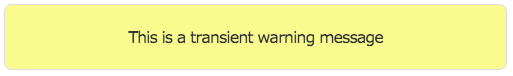
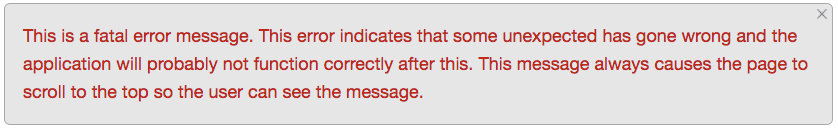

# Gromit

Gromit is primarily an OAuth2 client for AngularJS.  It's focused on the [Micro Focus](https://www.microfocus.com/) OAuth2 implementation called OSP, but it should work with generic OAuth2 providers.  

Along with OAuth2 support this library has support for other features like message handling in the UI, date formatting, and specialized CSS property handling.

There are two additional projects that support Gromit.

  * [Gromit Sample](https://github.com/Gromit-Soft/gromit-sample) - This project shows you how to use Gromit and contains a working example.
  * [Gromit Build](https://github.com/Gromit-Soft/gromit-build) - This project contains Gradle plugins to support Gromit.  These plugins aren't required, but they make things a little easier.

## Using Gromit

If you just want to download Gromit directly then you can get the latest from the [Sonatype Nexus server](https://oss.sonatype.org/#nexus-search;quick~gromit).


Gromit is available on Maven Central.  If you are using Maven you can include Gromit as a project dependency like this:

```xml
<dependency>
  <groupId>org.gromitsoft</groupId>
  <artifactId>gromit</artifactId>
  <version>1.0.4</version>
</dependency>
```

Include Gromit in a Gradle build environment like this:

```
api 'org.gromitsoft:gromit:1.0.4'
```

You can also include Gromit in your `package.json` file for an NPM based build.  There are specific [instructions for adding Gromit to an NPM and Gulp based project](https://github.com/MicroFocus/CX/blob/master/doc/gromit.md).

## OAuth2 Client

The Gromit OAuth2 client handles all logins, token validation and token refreshes seemlessly.  When you make an HTTP request with Gromit the library will handle any 401 responses or other responses indicating that you need a token.  It will then work with the OSP server to get a token and repeat your request.  You will never lose any state of your JavaScript application while this happens.

Gromit also has a request queue for handling multiple requests which all require a token.  In this case Gromit will suspend all the requests until the token is acquired and then replay any requests that happened during that process.

To use the Gromit OAuth2 client you must configure the following three properties:

```JavaScript
gromit.ClientId = 'myClientId';
gromit.AuthUrl = 'http://myserver/osp/a/idm/auth/oauth2/grant';
gromit.AuthLogoutUrl = 'http://myserver/osp/a/idm/auth/app/logout'; 
```

  * The `ClientId` is the OAuth2 client ID that you have configured.  You will set this client ID during the [configuration of your new SSO client](https://github.com/MicroFocus/CX/tree/master/token-validation#configuring-your-project).

  * The `AuthUrl` is the location of your OSP server.  This is the URL Gromit will redirect to when getting a token.

  * The `AuthLogoutUrl` is the location of your OSP server logout link.  Gromit redirects to this page for logging out.

Once you have configured your client you can make HTTP calls to your server with the following functions:  `gromit.get`, `gromit.post`, `gromit.put`, `gromit.del`.  These four functions support an HTTP GET, POST, PUT, and DELETE respectively.  

### gromit.init

The `gromit.init` function must be called before making HTTP requests with Gromit.  This function has no parameters and does not return any values.

### gromit.get

The `gromit.get` function supports HTTP GET operations.  The arguments to this function are:

  * `url` - The URL to make the GET request to
  * `http` - The Angular HTTP object to use for this request
  * `successCallback` - The callback function if the call succeeds
  * `errorCallback` - The callback function if the call fails with a well formatted error
  * `unknownErrorCallback` - The callback function if the call fails with an unknown error

**Code example**

```
gromit.get('http://myserver/myapi', $http, function(data) {
    $scope.data = data;
});
```

### gromit.post

The `gromit.post` function supports HTTP POST operations.  The arguments to this function are:

  * `url` - The URL to make the get request to
  * `http` - The Angular HTTP object to use for this request
  * `data` - A JavaScript object to send as the post body
  * `successCallback` - The callback function if the call succeeds
  * `errorCallback` - The callback function if the call fails with a well formatted error
  * `unknownErrorCallback` - The callback function if the call fails with an unknown error
  * `headers` - A JavaScript object containing key and value pairs for additional HTTP headers

**Code example**

```
var dataToSend = {'some key', 'some value'};
gromit.post('http://myserver/myapi', $http, dataToSend, function(data) {
    $scope.data = data;
});
```  

### gromit.put

The `gromit.put` function supports HTTP PUT operations.  The arguments to this function are:

  * `url` - The URL to make the get request to
  * `http` - The Angular HTTP object to use for this request
  * `data` - A JavaScript object to send as the post body
  * `successCallback` - The callback function if the call succeeds
  * `errorCallback` - The callback function if the call fails with a well formatted error
  * `unknownErrorCallback` - The callback function if the call fails with an unknown error

**Code example**

```
var dataToSend = {'some key', 'some value'};
gromit.put('http://myserver/myapi', $http, dataToSend, function(data) {
    $scope.data = data;
});
```

### gromit.del

The `gromit.del` function supports simple HTTP DELETE operations.  The arguments to this function are:

  * `url` - The URL to make the get request to
  * `http` - The Angular HTTP object to use for this request
  * `successCallback` - The callback function if the call succeeds
  * `errorCallback` - The callback function if the call fails with a well formatted error
  * `unknownErrorCallback` - The callback function if the call fails with an unknown error

**Code example**

```
gromit.del('http://myserver/myapi', $http, function(data) {
    $scope.data = data;
});
```
  
### Gromit callback functions

Gromit supports three callback functions.

`successCallback` handles successful HTTP requests.  This is called with a single argument containing any data that was returned from the server.  This argument may be null if the server didn't return any data.

`errorCallback` handles well formatted errors.  These errors have the following format:

```JavaScript
{
    "Fault": {
        "Code": {
            "Subcode": {
                "Value": "MyErrorSubCode"
            },
            "Value": "MyErrorCode"
        },
        "Reason": {
            "Text": "This is why my error happened"
        }
    }
}
```

This format is used by many of the Micro Focus REST APIs.

The `errorCallback` function is called with the following arguments:  The fault code, the fault subcode, and the fault reason text.  In this case the arguments would be `MyErrorCode`, `MyErrorSubCode`, and `This is why my error happened`.

`unknownErrorCallback` is called for all other errors.  This includes errors contacting the server and errors from the server that do not match the format sent to the `errorCallback` function.

The `unknownErrorCallback` function is called with the following arguments:  

  * The data sent back from the server
  * The HTTP status code returned by the server
  * A JavaScript object containing the HTTP headers sent from the server

###gromit.doLogout

This function securely logs the client out.  This will remove any data in JavaScript memory as well as any cookies that contain token data.  It will then send the logout request to the OSP server to complete the process.  The last step is that it will refresh the current page to remove any data from JavaScript memory that might be hanging around from the previous session.  

The `doLogout` function doesn't take any arguments.

```
gromit.doLogout();
```

## Showing messages with Gromit

Gromit provides the ability to show transient and permanent messages in your application.  

### gromit.showMessage

The `showMessage` function shows a transient message over the top of the page.  This message will disappear after five seconds.

**Code example**

```
gromit.showMessage('This is a transient information message');
```


### gromit.showWarningMessage

The `showWarningMessage` function shows a transient warning message over the top of the page.  This message will disappear after five seconds.

**Code example**

```
gromit.showWarningMessage('This is a transient warning message');
```



### gromit.showErrorMessage

The `showErrorMessage` function shows a transient error message over the top of the page.  This message will disappear after five seconds.

**Code example**

```
gromit.showErrorMessage('This is a transient error message');
```


### gromit.showFatalErrorMessage

The `showFatalErrorMessage` function shows an error message on the top of the page and scrolls the page to make that error visible.  This error message will stay until it is dismissed.

**Code example**

```
gromit.showErrorMessage('This is a transient error message');
```



## Date and time formatting

Gromit provides data and time formatting operations.  These operations are tied to the current locale and used for security checking during the login process.  Gromit provides this formatting through the [MomentJS](https://momentjs.com/) library.  You can use MomentJS directly, but Gromit also provides the following helper functions:

### gromit.setLocale

This function sets the locale for all future date formatting.

**Code example**

```
gromit.setLocale('en-US');
```

### gromit.fullDateTimeFormat

Format the full date and time.

**Code example**

```
var now = new Date().getTime();
console.log(gromit.fullDateTimeFormat(now));
```

**Result**

```
Wednesday, November 15, 2017 9:45 AM
```

### gromit.fullDateFormat

Format the full date.

**Code example**

```
var now = new Date().getTime();
console.log(gromit.fullDateFormat(now));
```

**Result**

```
Wednesday, November 15, 2017
```

### gromit.shortDateFormat

Format the short date.

**Code example**

```
var now = new Date().getTime();
console.log(gromit.shortDateFormat(now));
```

**Result**

```
11/15/2017
```

### gromit.shortDateTimeFormat

Format the short date and time.

**Code example**

```
var now = new Date().getTime();
console.log(gromit.shortDateTimeFormat(now));
```

**Result**

```
11/15/2017 9:45 AM
```

### gromit.fromNowFormat

Produce a string indicating the general timeframe between now and the specified date.

**Code example**

```
var newYears2016 = 1451606400000;
console.log(gromit.fromNowFormat(newYears2016));
```

**Result**

```
2 years ago
```

## Gromit options

Gromit also has the following options:

### gromit.addCSS

By default Gromit will add CSS supporting the Gromit UI features.  To disable this option set the `addCSS` property to `false` like this:

```
gromit.addCSS = false;
```

This must be set before calling the `gromit.init` function.


## Setting up the Gromit build environment

You don't need to build Gromit to use it, but setting the build is fast and easy.  Having the build running also gives you the chance to get a working example of Gromit up and running quickly.

Gromit builds with [Gradle](http://gradle.org/gradle-download/).  Download the latest and add it to your path.  I like to create an alias for the `gradle` command like this:

<code>alias gr='~/bin/gradle-4.1/bin/gradle'</code>

Gromit also uses JSHint for JavaScript checking.  You must install JSHint to run the build.  JSHint depends on Node.js so the first step is to [install Node.js](http://nodejs.org/download/).  

Once you've installed Node.js you can run this command to install JSHint:

<code>npm install jshint -g</code>

Verify your setup by running the two following commands:

<pre><code>gradle -version</code>
<code>jshint -version</code></pre>

Get the Gromit source code:

<pre><code>git clone https://github.com/Gromit-Soft/gromit.git
git clone https://github.com/Gromit-Soft/gromit-sample.git</code></pre>

## Building Gromit


Gromit is made up of two projects:  the Gromit core (just called Gromit) and the Gromit sample application which contains documentation and a running sample of Gromit.  Start by building the Gromit core:

<pre><code>cd gromit
gradle
</code></pre>

This build will create the Gromit core artifact and install it in your local Maven cache.  

The Gromit sample application contains an embedded server so you can easily run the application.  You can start it like this:

<pre><code>cd gromit-sample
gradle
</code></pre>

At this point your Gromit sample server will be running on [your local server](http://localhost:8081) on port 8081.  You can use this configuration to make live changes to the sample code.

## Verifying the gromit-sample build

If you are changing the Gromit code then you must run and extra step.  Make your change with the Gradle server running and do whatever testing you need to.

Once your change is complete you must run JSHint and verify the build.  You must run this command before you commit your changes to gromit-sample.

<pre><code>gradle clean war
</code></pre>
